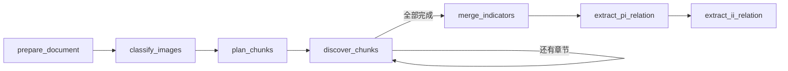

# 科学计量指标多模态抽取

从已解析的 Markdown 开始，图片仅使用 HTTP(S) URL。每篇论文只保存一个符合 Pydantic/JSON Schema 的最终数据文件 `result.json`；该文件是抽取记录，不是 schema 定义文件。

## 安装与运行

```bash
uv sync
cp .env.example .env
# 在 .env 填写 DEEPSEEK_API_KEY，在 run.toml 设置 input
make run
# 批处理：将 input 改为目录，默认递归匹配 *.md
```

图片示例：

```markdown

```

本程序不下载图片、不读取本地图片、不发送 Base64，也不执行 PDF/MinerU 解析。图片 URL 必须能由 DeepSeek 访问。另支持引用式 Markdown 图片和 HTML img；代码块中的图片语法不会被当作真实图片。

## 当前流程

### 项目结构

```text
src/scimetrics/
├── __init__.py
├── cli.py              # 命令入口、配置和检查点操作
├── pipeline.py         # 主流程、State 与 LangGraph 编排
├── models.py           # 抽取数据的 schema
├── prompts.py          # 各节点提示词
└── utils/
    ├── __init__.py
    ├── document.py     # Markdown 解析、章节划分、多模态消息与文件工具
    ├── evidence.py     # 证据定位、校验及错误诊断
    ├── client.py       # DeepSeek 请求与响应解析
    └── observability.py # LangSmith 追踪
```

工具模块不依赖主流程；主流程负责组合工具与业务 schema。此次仅调整模块路径，节点名称和 State 字段不变，不需要因此新建检查点任务。



1. **prepare_document**：读取原文并识别图片 URL、编号和字符位置。
2. **classify_images**：逐张仅发送 image_url，系统提示词说明科学/非科学二分类任务。不发送正文、图注或 alt。
3. **plan_chunks**：Markdown 一级、二级标题均作为独立章节边界（不猜测被 MinerU 扁平化的子标题层级）。过滤 References、Bibliography、Funding、Acknowledgements、Author contributions、Conflict of interest 及常见拼写变体；其他章节默认保留，包含 Abstract、Appendix。只有标题没有正文的章节过滤，只有科学图片的章节保留。记录跳过原因。正文和位置不改写。
4. **discover_chunks**：每个保留章节单独调用模型。正文和科学图片按原文顺序发送，非科学图片语法跳过。程序分配全局唯一候选 ID，如 C0002_I001。章节超过配置上限时报错，不自行截断或再拆分。每次节点执行只处理一章，成功后将结果追加到 State 的 chunk_discoveries；检查点模式在下一章开始前同步保存。失败时重试当前章节，已完成章节不重复调用。
5. **merge_indicators**：模型根据候选名称、定义与原始证据输出归并分组；程序要求每个候选恰好属于一组，不确定则分开。按组分配 I001 等统一 ID，程序合并别名、定义、评价对象、证据及来源章节，保留 merge_map。不让模型重新生成证据。零候选或单候选不发起归并模型调用。
6. **extract_pi_relation**：原始全文（包括参考文献）＋科学图片＋固定指标清单，独立抽取 PROPOSES/MODIFIES/APPLIES。参考文献仅辅助归因，不把他人成果归给本文。无指标时返回空列表。
7. **extract_ii_relation**：相同全文多模态输入＋指标清单，独立抽取 VARIANT_OF/DERIVED_FROM/IMPROVES_ON/ALTERNATIVE_TO/COMPONENT_OF；不足两个指标时返回空列表。完成后写 result.json。

关系节点只使用已归并的指标 ID；不在两个关系调用中分别新增实体，避免 ID 不一致。当前流程按本次要求专注指标和两类关系，当前未实现公式/局限性抽取。

## 输出与失败诊断

每篇输出路径：`outputs/文件名-路径哈希/result.json`。

字段包括 indicators、merge_map、paper_relations、indicator_relations、chunks、skipped_sections、status。指标保留 definitions 列表以避免丢弃不同章节表述。

证据不再包含 source_id。文字 quote 直接在原始 chunk（关系阶段为原始全文）匹配，允许空白差异，不在候选清单或提示词里匹配。视觉 quote 保存完整图片 URL，observation 描述区域及所见；URL 必须属于本次实际发送的图片。消息不添加 B/F 编号，仅按图片位置组织前文 text → image_url → 后文 text，不插入图片来源 URL 说明块。视觉证据 URL 直接与本次 image_url.url 比较。内部 figure_id 仅用于分类追踪。来源校验不代表语义正确，结果仍标记 extracted_unverified。

## 模型与限制

提示词在 `src/scimetrics/prompts.py`，schema 在 `src/scimetrics/models.py`。每次调用使用系统提示词加 JSON Schema，用户消息为文本/图片数组；JSON mode 后仍有 Pydantic 结构校验。默认模型 deepseek-flash。

run.toml 默认配置为 `max_chars = 250000`、`max_images = 40`（过滤后图片数）、`max_body_bytes = 40000000`、`max_output_tokens = 65536`。超限或输出截断会停止该篇，不静默裁剪。字符数不是精确 token 计数。HTTP 请求超时 `timeout = 600` 秒，SDK 最多重试 2 次，没有语义修复与本地缓存。

## LangSmith

可选开启：

```dotenv
LANGSMITH_TRACING=true
LANGSMITH_API_KEY=你的LangSmith密钥
LANGSMITH_PROJECT=scimetrics
LANGSMITH_ENDPOINT=https://api.smith.langchain.com
```

Endpoint 按账号区域配置。启用后，Graph 节点及通过 wrap_openai 包装的 DeepSeek 调用会被追踪，包含输入、图片 URL、输出、耗时、token 用量与错误；这些内容会上传 LangSmith。没有本地日志或 trace ID 文件。在 LangSmith 项目中按 `paper:文件名` 查看，模型调用名为 `deepseek:classify_F0001`、`deepseek:discover_C0001`、`deepseek:merge_indicators`、`deepseek:extract_pi_relation`、`deepseek:extract_ii_relation`。价格统计取决于平台配置，不硬编码模型价格。

## 文件配置与 Make 命令

运行参数集中在项目根目录的 `run.toml`；密钥、DeepSeek 服务地址和 LangSmith 开关放在 `.env`。CLI 仅接受 `--config` 和 `--action`（以及帮助 `--help`）；运行参数由 TOML 统一加载、校验，未填写的可选项使用内置默认值。只有 action 可以在命令行覆盖。模型由 run.toml 的 model 配置。

先修改 `run.toml` 的 input，指向你的 Markdown。其余参数可直接编辑文件：

```toml
[run]
input = "data/paper.md"
output = "outputs"
action = "run"
model = "deepseek-flash"
db = ".debug/checkpoints.sqlite"
thread_id = "paper-001"
stop_after = ["prepare_document", "classify_images", "plan_chunks", "merge_indicators"]
stop_before = ["merge_indicators"]
field = "all"
```

TOML 中的相对路径相对于配置文件目录，程序也从该目录加载 .env；已有环境变量优先。--config 的相对路径相对于当前工作目录。直接 `uv run scimetrics` 会读取当前目录的 run.toml。使用其他配置：`make run CONFIG=another.toml`。

| 命令 | 行为 |
| --- | --- |
| `make install` | 安装项目依赖 |
| `make run` | 全流程执行，不启用检查点，忽略 stop_after 和 stop_before |
| `make start` | 新建检查点任务，到第一个指定断点暂停 |
| `make inspect` | 查看 SQLite 中已保存的 State，不执行模型调用 |
| `make resume` | 从检查点继续，到下一个指定断点暂停 |
| `make continue` | 从检查点执行全部剩余节点，忽略 stop_after 和 stop_before |

例如：make start → make inspect → make resume → make inspect → make continue。inspect 显示的 next 是将要执行的节点，state 由 field 选择。stop_after=[] 且 stop_before=[] 表示不设置断点。图片分类循环在同一节点内，只能在整批图片分类后暂停。

## 统一 CLI 与检查点恢复

没有独立 debug.py 或 scimetrics-debug 命令。完整运行与调试逻辑均在 `src/scimetrics/cli.py`，图的编排在 `pipeline.py`。命令行只选择配置文件和动作，其余选项直接修改 TOML：

```bash
uv run scimetrics --config run.toml --action start
uv run scimetrics --config run.toml --action inspect
uv run scimetrics --config run.toml --action resume
uv run scimetrics --config run.toml --action continue
```

首次 start 保存输入绝对路径、输出路径、模型及初始限额到同一 SQLite。后续 resume 固定使用已保存的输入、输出和模型，但 max_output_tokens、timeout、max_chars、max_images、max_body_bytes 使用当前 run.toml 的值，并打印实际限额；因此输出截断后可以提高限额直接恢复。更换输入或模型需新 thread_id 并 start。db、thread_id、stop_after、stop_before 以及 inspect 的 field 使用当前配置。

成功运行仅保存最终 JSON；证据校验失败时额外保存 evidence_errors 下的诊断报告与抽取响应。检查点模式额外保存 SQLite 数据库（默认 .debug/checkpoints.sqlite，已忽略提交），支持退出程序后继续。不要并发操作相同 thread_id。跨工作目录运行应指定相同配置文件或数据库绝对路径。

prepare_document 不调用模型，不需要 DeepSeek Key。inspect 不启用云端追踪。恢复到模型节点时才需要 Key。原 Markdown 内容变化会拒绝 resume；需要新建任务。修改提示词不阻止恢复，后续节点使用当前代码中的提示词，已完成节点不会自动重跑。图片 URL 内容变化无法本地检测。模型服务端地址来自当前 .env，恢复时应保持一致。

完成后 next 为空；再次 resume 不重复执行。extract_ii_relation 后暂停时 result.json 已保存。节点中途失败恢复会重跑失败节点，可能重复已发出的 API 请求。程序仅保存节点边界检查点，不能在图片分类循环内部逐图恢复。

`discover_chunks` 现在每次执行一章，由条件边返回自身或进入 merge_indicators。成功章节（包括未发现指标的章节）写入 chunk_discoveries，其长度就是已完成进度。请求、结构或证据校验失败时不提交本章，resume 重试这一章。inspect 的 discovery_progress 显示已完成/总章节数。stop_after 包含 discover_chunks 时，每成功一章暂停一次；make continue 忽略暂停点，仍逐章同步保存。make run 不启用检查点，无法跨进程恢复。

仅支持当前 State 结构，不提供旧检查点迁移。更新前未包含 chunk_discoveries 的任务请更换 thread_id 后 make start；检查点数据库和已有结果不会被自动删除。LangSmith 的调用记录用于诊断，不会自动成为可恢复状态。图片分类仍为整批处理。图执行步数上限为 10000，避免章节循环触发默认的较小步数上限。

make resume 遵循 stop_after 和 stop_before。当前配置保留准备、分类、划分及归并后的暂停点，移除 discover_chunks 后的暂停点，并在 merge_indicators 前暂停：从 plan_chunks 完成处恢复，将处理全部剩余章节后停在归并前，再次 resume 执行归并并在归并后暂停。若将 discover_chunks 加回 stop_after，则每章暂停。make continue 临时清空前后暂停点，运行到结束或报错，仍逐章保存。

LangGraph 支持读取 `graph.get_state_history(config)`，选择历史快照后用 `graph.invoke(None, snapshot.config)` 从该快照继续执行。快照表示节点执行后的状态，因此要重新执行某节点，应选它执行前的快照（`next` 包含该节点）。这会重放后续节点并形成分支，不删除历史，不撤销模型调用费用或已写文件。目前 CLI 的 resume 只读取最新检查点，尚未提供选择历史 checkpoint_id 的入口。详见 [LangGraph time travel](https://docs.langchain.com/oss/python/langgraph/use-time-travel)。

项目不包含测试目录或 pytest 依赖。

### 证据校验失败诊断

`check_evidence` 会一次列出所有失败证据，打印节点、输入文件、chunk 标题和字符范围、JSON 字段路径（数组下标从 0 开始）、所属指标/关系、完整 quote。文字证据还提供近似原文、Markdown 行号、全局字符范围及差异片段；近似匹配仅供诊断，绝不据此接受证据。视觉错误列出本次实际发送的图片 URL。

失败详情和完整抽取响应保存到每篇输出目录的 `evidence_errors/<stage>.json`，方便不重调 API 就检查失败内容。重复失败会覆盖该阶段的旧报告；已存在的报告是历史诊断，不表示本轮仍失败。

文字匹配忽略连续空白差异；仅在 `$...$`、`$$...$$`、`\(...\)`、`\[...\]` 数学片段内，进一步忽略 LaTeX 命令与左花括号间的空白，例如 `\operatorname {cit}` 与 `\operatorname{cit}`。不做公式等价推断，也不忽略标点、符号或数值差异。

公式证据先进行仅折叠空白的原文匹配，避免规范化破坏已有匹配；对于不带数学定界符的公式引句，额外在原文数学片段内使用相同的 LaTeX 空白规范化规则比较。原始引句和原文不改写，近似匹配仍只用于诊断。
