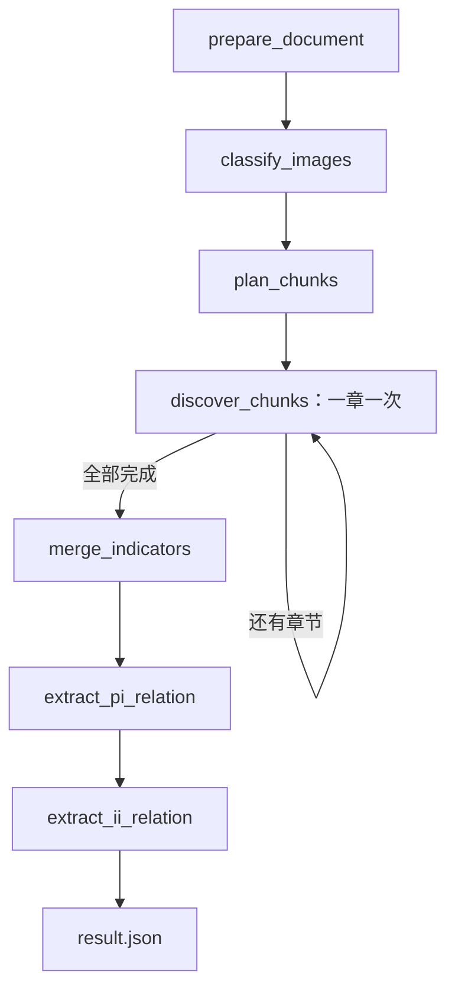
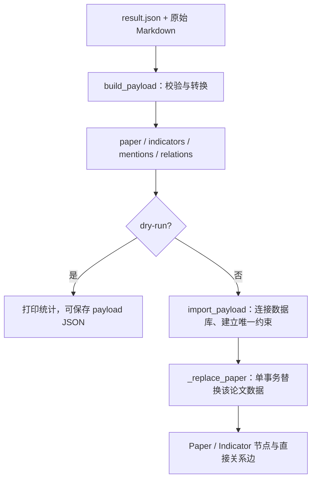
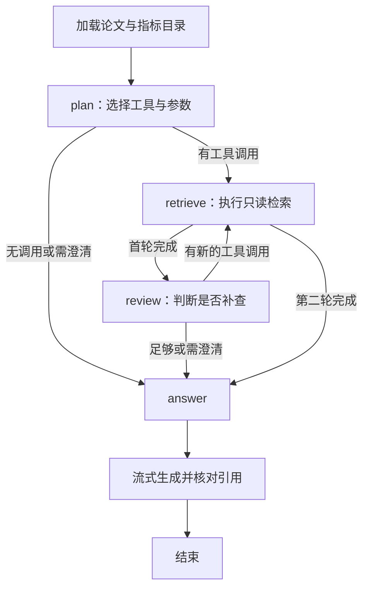
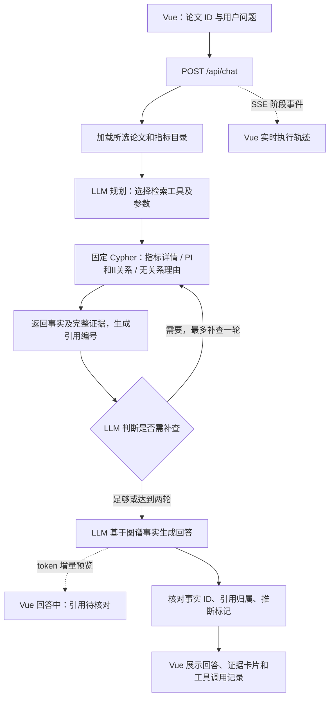

# 科学计量指标知识图谱与证据问答

项目包含三个模块，按数据流依次运行：**IE 抽取 → graph_db 入库 → app 问答**。模块之间通过结果文件和 Neo4j 解耦，可独立运行；问答不需要重新抽取论文。

| 模块 | 目录 | 输入 | 输出 |
| --- | --- | --- | --- |
| IE：信息抽取 | `src/ie` | 已解析论文 Markdown 与图片 URL | 指标、PI/II 关系及证据 `result.json` |
| graph_db：图谱入库 | `src/graph_db` | `result.json`、原始 Markdown | Neo4j 节点和直接关系边 |
| app：知识问答 | `src/app` | 用户问题、论文 ID、已入库图谱 | SSE 流式回答、执行轨迹和证据引用 |

当前范围是单篇论文指标发现、文内归并、关系抽取、入库与证据问答。不包含 PDF/MinerU 解析、独立公式/局限性抽取或跨论文实体归并。`extracted_unverified` 表示抽取结果尚未经过完整语义复核；原文定位或引用归属通过，不等于关系判断必然正确。

## 项目结构与环境

```text
project/
├── src/
│   ├── ie/                       # 信息抽取工作流
│   │   ├── cli.py                # 运行、检查点、重放
│   │   ├── pipeline.py           # LangGraph 图、节点和 State
│   │   ├── models.py / prompts.py # 输出契约和提示词
│   │   └── utils/                # 文档、模型调用、证据、归并、追踪
│   ├── graph_db/
│   │   └── neo4j_import.py        # 数据转换与事务写入
│   └── app/
│       ├── backend/
│       │   ├── main.py           # FastAPI 与 SSE
│       │   ├── agent.py          # 检索 Agent
│       │   ├── store.py          # Neo4j 只读工具
│       │   └── schemas.py / prompts.py
│       └── frontend/
│           ├── src/App.vue
│           ├── src/api.ts / types.ts / main.ts / style.css
│           ├── vite.config.ts / tsconfig.json
│           └── package.json / pnpm-lock.yaml / pnpm-workspace.yaml
├── run.toml                      # IE 运行参数
├── .env.example                  # 密钥、数据库和问答配置示例
├── Makefile                      # 统一命令入口
├── pyproject.toml / uv.lock       # Python 依赖
├── AGENTS.md                     # 开发约定
├── data/                         # 原始 Markdown
├── outputs/                      # 抽取和转换结果
└── .debug/
    ├── checkpoints.sqlite        # IE 检查点历史与任务配置
    └── .reports/                 # IE 状态查看报告
```

- Python 3.13+、uv：三个模块的 Python 依赖。
- Node.js 22.12+、pnpm 11.2.2：app 前端。
- Neo4j：graph_db 和 app 使用；可运行在本地 Docker 中。
- DeepSeek API：IE 抽取和 app 问答使用；纯转换/入库不调用模型。

在项目根目录运行命令。首次安装可用 `make install`（Python）或 `make qa-install`（Python＋前端）。首次配置时将 `.env.example` 复制为 `.env` 并填写，已有 `.env` 时直接编辑，勿覆盖已有配置。IE 参数放在 `run.toml`；模型密钥和 Neo4j 密码只保存在后端环境中。

## 1. IE：论文信息抽取

### 输入与运行入口

输入必须是已有 `.md` 文件；`make run` 也支持目录批处理。图片必须使用模型服务能访问的 HTTP(S) URL，例如：

```markdown

```

不下载图片、不读取本地图片、不发送 Base64。支持普通 Markdown 图片、引用式图片和 HTML img；代码中的图片语法不作为真实图片。

### Agent 架构与状态流转

IE 的编排入口是 `pipeline.py::build_graph`，没有单独的 `agent.py`。它是固定工作流式的多模态抽取 Agent：代码决定节点次序和章节循环，模型在节点内按 Schema 分类、发现指标、判断归并和抽取关系，不自主选择外部工具或生成执行代码。

| 层次 | 实现 | 职责 |
| --- | --- | --- |
| 运行控制 | `cli.py` | 读取配置、创建模型客户端、启动/恢复/重放任务 |
| 图编排 | `pipeline.py` | LangGraph StateGraph、节点路由、状态更新、结果落盘 |
| 模型契约 | `prompts.py`、`models.py` | “总纲＋字段填写规则”提示词、Pydantic 输出 Schema |
| 模型调用 | `utils/client.py` | DeepSeek 多模态 JSON 请求、输出结束状态检查 |
| 确定性工具 | `utils/document.py`、`utils/evidence.py`、`utils/merge.py` | 文档分章、消息构造、来源定位、归并约束 |
| 持久化与诊断 | CLI 中的 SQLite checkpointer、`utils/observability.py` | 检查点恢复、可选 LangSmith 追踪 |

共享 `State` 从原文逐步积累图片、章节、候选指标、统一指标和关系。节点返回更新字典；发现节点不会原地修改输入，只有模型请求、结构检查、证据检查全部成功后才提交本章结果。




| 节点 | 输入与处理 | 写入 State |
| --- | --- | --- |
| prepare_document | 读取 Markdown，识别图片及原文位置 | raw_content、images |
| classify_images | 每次只发送一张图片，判断 scientific/decorative | images 的 classification |
| plan_chunks | 按一级、二级标题划分；过滤参考文献、基金、致谢、作者贡献、利益冲突等章节及空正文 | chunks、skipped_sections，初始化 chunk_discoveries |
| discover_chunks | 每次处理一个保留章节及科学图片，只发现本章有明确名称、缩写或已定义符号的指标 | 追加一个章节的 chunk_discoveries |
| merge_indicators | 候选归并；有歧义时补充候选来源章节及图片复核一次 | discovery、merge_map |
| extract_pi_relation | 所有保留章节＋其中科学图片＋统一指标清单 | paper_relations |
| extract_ii_relation | 同样的保留章节与清单，抽取指标间关系并写最终文件 | indicator_relations、extraction |

原文不改写。构造模型消息时，科学图片替换为真正的 `image_url` 内容块，按原文位置保持“前文 text → image_url → 后文 text”；装饰图片语法跳过。不插入 B/F 证据编号或额外图片 URL 说明块。

`chunks` 的 ID 沿用原章节编号，因此跳过章节后编号不连续。章节超过限额时报错，不自动拆分或截断。图片分类仍在一个节点内循环，不具备逐图恢复。

#### 发现与归并

discover 输出 `indicator_id、name、aliases、definition、evidence`。程序将临时 ID 改为 `C0007_I001` 等文内候选 ID。无定义时 `definition=null`，无指标时 `indicators=[]`；泛称和普通变量不应成为指标。

归并首轮只使用全部候选记录，输出 `confirmed` 或 `needs_context` 分组。每个候选必须恰好属于一组，`evidence_refs` 用候选 ID 和证据下标引用依据。规范名与别名必须来自组内候选。

每个 `needs_context` 集合单独补充其来源章节及科学图片复核一次，不检索其他章节。复核后全部为 `confirmed`；缺少合并依据的候选分别成组，原因写入 `reason`。这里 confirmed 表示最终分组确定，不等于证明各组绝不相同。程序验证补充证据，并汇总原始字段，不让模型重写已有证据。

归并后的 `discovery.indicators` 每项为：

```text
indicator_id, name, aliases, definitions, evidence,
source_chunk_ids, candidate_ids
```

`definitions` 是列表。`merge_map` 保存 `canonical_name`、分组成员、依据引用、补充证据及复核记录；`name` 属于最终指标，`canonical_name` 属于归并映射。关系节点只收到 `discovery`，不接收整个 State 或 merge_map。

#### PI：每个指标一条判定

输出字段：

```text
indicator_id, predicate, assertion_mode, evidence, rationale_summary,
no_relation_reason, no_relation_detail
```

必须覆盖全部指标，无遗漏、重复或新增 ID。有依据时按 `PROPOSES > MODIFIES > APPLIES` 选一个主关系：提出后又应用，仅输出 PROPOSES。无关系时 `predicate=null`、`assertion_mode=null`，记录“仅背景提及／未实际应用／证据不足”及具体原因。有关系时两个无关系原因字段为 null。

有关系至少一条证据；仅背景提及和未实际应用也需相关证据，证据不足允许 `evidence=[]`。无关系记录不生成 PROPOSES/MODIFIES/APPLIES 业务边；graph_db 将其理由和证据保存在辅助 MENTIONS 边上。PROPOSES 是基于本文证据的判断，不代表已外部核实全球首创。

#### II：有据的指标间关系

输出字段：

```text
subject_id, predicate, object_id, assertion_mode, evidence, rationale_summary
```

端点必须是归并后的统一 ID，无自关系。同一指标对可有不同标签，但每种关系要有独立依据；同一三元组仅一条，多处证据汇总。不枚举所有指标对，不输出 null 或无关系记录；无关系或指标少于两个时返回空列表。

| predicate | 方向与含义 |
| --- | --- |
| VARIANT_OF | A → B：A 是 B 的明确变体 |
| DERIVED_FROM | A → B：A 直接来源于 B，改动超出简单变体 |
| IMPROVES_ON | A → B：A 针对 B 的缺陷改进 |
| ALTERNATIVE_TO | 对称：特定条件下可替代或竞争；每对只保存一次 |
| COMPONENT_OF | A → B：A 是 B 的输入指标、子指标或组成部分 |

同一方向不能同时为 VARIANT_OF 和 DERIVED_FROM；可与有独立依据的 IMPROVES_ON 等并存。ALTERNATIVE_TO 按指标清单顺序统一端点，反向重复也报错。没有 PI 的主关系优先级。代码校验结构及来源，不自动证明模型的关系语义判断。

PI 和 II 均区分 `explicit` 与 `inferred`。推断必须提供非空 `rationale_summary`，提示词要求说明“这是推断”，并按本条 evidence 下标指出依据。必要前提、适用条件和改进目标写入摘要，不单设 assumptions、scope 或 origin_status。II 不读取 PI 判定，不能因为本文同时使用两个指标就假定它们有关系。

### 证据校验与输出

模型生成的证据为 `kind、quote、observation`。文字 quote 须逐字引用，保留大小写、OCR 拼写及 LaTeX；视觉 quote 为实际图片 URL，observation 描述区域及所见。

程序先精确匹配（exact），再有限排版规范化匹配（normalized）：统一连续空白、排版引号、部分 Unicode 连字符和连字，以及连接符/括号等边界空白。保留普通词间空格、大小写、数值和小数点，不做任意模糊放行或公式等价推断。失败仅保存诊断并报错，不额外调用模型修复。

文字证据成功后，`quote` 保存真实原文，附加 `extracted_quote、match_method、source_file、source_spans`；唯一匹配时额外写 `source_start/source_end`。位置为原 Markdown 的 Python 字符偏移，左闭右开。多处匹配保留全部位置及对应原句。元数据由程序添加，不要求模型生成；视觉证据无文字位置字段。

PI/II 的单条文字证据必须位于某个保留章节内，不能引用 skipped_sections 或跨章节拼接。近似定位可能显示其他位置，但仅供诊断。旧章节结果不会自动补写新字段。

最终 JSON 包含：

```text
status, indicators, merge_map, paper_relations, indicator_relations,
chunks, skipped_sections
```

| 模式或产物 | 位置 |
| --- | --- |
| make run | `<output>/<文件名>-<路径哈希前8位>/result.json` |
| 检查点任务 | 首次 start 保存的 `<output>/result.json` |
| 证据失败诊断和本次抽取结果 | 对应输出目录的 `evidence_errors/<stage>.json` |
| 检查点报告 | `<db所在目录>/.reports/<thread_id>.json` |

报告会覆盖；执行 make inspect 才会导出所选 State 字段与任务错误。SQLite 保存历史检查点，报告 JSON 不是恢复依据。历史错误报告不表示本轮仍失败；重跑可能覆盖同名结果文件。

### 配置

参数统一放在 run.toml 的 `[run]`，密钥放在 `.env`。示例：

```toml
[run]
input = "data/paper.md"
output = "outputs"
action = "run"
pattern = "*.md"
model = "deepseek-flash"
max_output_tokens = 65536
max_chars = 250000
max_images = 40
max_body_bytes = 40000000
timeout = 600

db = ".debug/checkpoints.sqlite"
thread_id = "paper-001"
replay_node = "extract_pi_relation"
stop_after = ["prepare_document", "classify_images", "plan_chunks", "merge_indicators", "extract_pi_relation"]
stop_before = ["merge_indicators"]
field = "all"
```

`input/output/db` 的相对路径相对于配置文件目录；`.env` 也从该目录加载，已有环境变量优先。CLI 的 `--config` 相对于当前工作目录。代码中 output 未配置时默认为 `.debug`，项目 run.toml 显式配置为 outputs。

`max_output_tokens` 控制单次输出上限，timeout 单位秒；其余为文本字符、科学图片数量及消息体字节预算，不能等同于模型 token 上下文上限。关系节点对所有保留章节和清单的总输入检查限额。HTTP SDK 最多重试两次；JSON 解析、语义和来源校验失败不自动重试。非 stop 响应打印 finish_reason、token 用量和响应 ID。

`field` 可选 all、raw_content、images、chunks、skipped_sections、chunk_discoveries、discovery、merge_map、paper_relations、indicator_relations、extraction。

### 检查点与恢复

IE 的 Make 命令统一读取 `run.toml`；完整命令表见文末。CLI 仅接受 `--config`、`--action` 和帮助选项，Make 动作覆盖 TOML 的 action。

```bash
make resume CONFIG=another.toml
uv run ie --config run.toml --action inspect
```

#### 按阶段运行

```bash
make start       # 新任务：prepare 完成后暂停
make resume      # classify 完成后暂停
make resume      # plan 完成后暂停
make resume      # 所有 chunk 完成，merge 开始前暂停
make inspect
make resume      # merge 完成后暂停
make resume      # PI 完成后暂停
make inspect
make resume      # II 完成，保存最终结果
```

以上对应示例暂停配置。discover_chunks 每次执行一章并在下一步前同步保存；失败后 resume 只重做失败章节。若将 discover_chunks 加回 stop_after，则每成功一章暂停。前后暂停列表都为空时 resume 与 continue 效果相同。

分类和整个 merge 各自仍是一个执行步，节点内部中途失败会重做整个节点。图步数上限为 10000。不要并发运行相同 thread_id。

#### 重跑 PI 或 II

将 replay_node 设置为目标节点，例如：

```toml
replay_node = "extract_ii_relation"
```

```bash
make replay
make inspect
```

replay 从同一 thread_id 的历史中，选择最近一个 next 包含目标节点的检查点，从那里执行。不会从头重跑，也不会删除旧历史；找不到历史起点则报错。新执行产生分支，之后 resume 从最新检查点继续。对 discover_chunks 的 replay 只从最近一次待处理章节处开始，不表示重做全部章节。

replay 仍遵循暂停点；当前 PI 后有暂停，II 完成则写结果。每次 replay 都重新选择历史起点，resume 不使用 replay_node。服务调用会重新产生费用，最终文件可能覆盖，旧检查点不会撤销文件等外部副作用。

#### 配置变更

start 固定保存输入、输出、模型及输入文件哈希。resume/replay 使用保存的输入、输出和模型，但使用当前 TOML 的五项资源限额、暂停配置等。更改原始 Markdown 会拒绝恢复；需新 thread_id。修改代码/提示词只影响后续或重跑的节点，不自动更新已完成结果。不提供旧 State/schema 迁移。

### LangSmith 追踪

`.env.example` 提供 LANGSMITH_TRACING、LANGSMITH_API_KEY、LANGSMITH_PROJECT、LANGSMITH_ENDPOINT。启用后，IE 的模型输入、输出及图片 URL 等会上传追踪服务。LangSmith 用于诊断，SQLite checkpoint 用于恢复，两者不能互相替代。

## 2. graph_db：单篇论文图谱入库

### 职责与数据转换

该模块独立读取最终 `result.json`，不调用抽取模型，也不实现问答。使用 `graph_db` 包名避免与官方 `neo4j` 驱动重名。

入口为 `neo4j_import.py`，模块不包含 Agent。它使用确定性的 Python 转换和参数化 Cypher，不调用模型。



`build_payload` 读取论文标题和文件哈希，为指标添加论文命名空间，检查 PI 覆盖、II 端点及关系冲突，并将证据转换成可写入 Neo4j 的属性。返回值：

```text
paper       = {id, title, source_file, source_sha256, result_sha256, ...}
indicators  = [{id, props}]
mentions    = [{id: 目标指标ID, props}]
relations   = [{subject, object, kind: PI或II, predicate, props}]
```

`props` 是节点/关系属性。`kind` 用于选择起点节点类型，`predicate` 决定实际边类型；转换过程只在内存中运行，真正写库发生在 `import_payload` 中。

### 运行与转换预览

先启动 Neo4j 数据库，并在 `.env` 配置 `NEO4J_URI`、`NEO4J_USER`、`NEO4J_PASSWORD`、`NEO4J_DATABASE`（参考 `.env.example`）。导入账户需要写入和建立唯一约束的权限。

先做本地转换检查，不连接数据库：

```bash
uv run neo4j-import --result outputs/result.json --source "data/paper.md" \
  --paper-id paper-001 --dry-run --payload-output outputs/graph-payload.json
```

将 `data/paper.md` 替换为实际抽取使用的 Markdown。正式导入：

```bash
uv run neo4j-import --result outputs/result.json --source "data/paper.md" --paper-id paper-001
# 等价 Make 命令
make neo4j-import RESULT=outputs/result.json SOURCE="data/paper.md" PAPER_ID=paper-001
```

`--title` 可指定标题，默认读取 Markdown 第一个一级标题。建议显式指定稳定的 `--paper-id`；省略时使用 Markdown 内容 SHA256，修改 Markdown 会被视为新论文。文件 SHA256、结果 SHA256 和源路径保存在 Paper 节点。已有证据的 source_spans 会与所提供的原文核对，但导入不会重新验证抽取的语义真实性。

### 图谱模型与证据存储

图谱模型只有两类节点：

- `Paper`：论文元数据、抽取状态，以及序列化的章节、过滤章节、归并记录。
- `Indicator`：论文命名空间内的指标，保存名称、别名、定义、来源章节和指标发现证据。

PI 直接写为 `Paper -[:PROPOSES|MODIFIES|APPLIES]-> Indicator`（每个指标最多一类有效 PI）。II 直接写为指标间的 VARIANT_OF、DERIVED_FROM、IMPROVES_ON、ALTERNATIVE_TO、COMPONENT_OF 边，支持同一对指标的不同关系。ALTERNATIVE_TO 按指标清单顺序保存一次，语义上为对称关系，查询时可忽略箭头方向。

每条业务关系保存：

| 属性 | 内容 |
|---|---|
| relation_id | 由论文、端点和关系类型生成的稳定 ID |
| paper_id / importer | 来源论文和导入器 |
| assertion_mode | explicit 或 inferred |
| rationale_summary | 判断依据摘要及适用条件 |
| evidence_json | 完整证据数组的 JSON 字符串，包含观察描述、原句和来源位置 |
| evidence_quotes | 引句或图片链接的字符串数组，方便展示 |
| evidence_count | 该关系证据条数 |
| status | 保留抽取结果状态，入库不代表语义验证通过 |

证据顺序与原结果一致，保留依据摘要中的证据下标。视觉证据的 quote 是图片 URL，observation 保存在 evidence_json 中。Neo4j 属性不能直接保存嵌套对象数组，因此完整证据序列化保存，不再生成 Assertion、Evidence 节点。指标发现证据保存为 Indicator 的同名 evidence_* 属性，与关系证据分别维护。

每篇论文仍通过辅助 `MENTIONS` 连接全部指标。仅无有效 PI 的 MENTIONS 保存 no_relation_reason、no_relation_detail、rationale_summary 和 evidence_*；有效 PI 的证据只写在实际业务关系上。展示主图时可隐藏 MENTIONS。

### 重复导入与事务

重复导入相同 paper_id，会在单个事务内删除该导入器拥有的旧指标及关联边并重建。也会清理该论文旧版 Assertion/Evidence 节点；其他论文和其他导入器数据不受影响。不会自动删除数据库级旧约束，避免影响其他尚未重导入的论文。自动生成节点上的人工附加关系会随删除重建丢失，请另行保存人工标注。唯一约束单独建立；数据事务失败会回滚，保留此前图谱。

成功输出论文、指标、MENTIONS、PI/II、无关系记录数量；evidence_entries 是所有节点和关系属性内的证据条目总数，同一证据被多处引用时分别计数。`--dry-run` 不连接数据库，不代表写入成功。

### 在 Neo4j Browser 查看

打开 http://localhost:7474/browser/，登录后执行以下查询。

查看论文的业务关系（隐藏 MENTIONS）：

```cypher
MATCH (s)-[r]->(o)
WHERE r.paper_id = 'paper-001' AND r.importer = 'ie_import'
  AND type(r) <> 'MENTIONS'
RETURN s, r, o
```

查看本文提出的指标及证据：

```cypher
MATCH (p:Paper {id: 'paper-001'})-[r:PROPOSES]->(i:Indicator)
RETURN i.name, r.relation_id, r.assertion_mode, r.rationale_summary,
       r.evidence_quotes, r.evidence_json
```

查询没有有效 PI 关系的指标及原因：

```cypher
MATCH (p:Paper {id: 'paper-001'})-[m:MENTIONS]->(i:Indicator)
WHERE m.no_relation_reason IS NOT NULL
RETURN i.name, m.no_relation_reason, m.no_relation_detail, m.evidence_quotes
```

前端悬浮关系时可显示 type(r)、assertion_mode 和 evidence_quotes；点击详情时解析 evidence_json，展示全部引句、视觉观察及来源位置。稳定定位使用 relation_id。graph_db 仅负责存储；app 已实现问答及证据卡片，但尚未实现交互图谱的关系悬浮框。Neo4j Browser 不会因属性存在就自动生成定制的悬浮框。

## 3. app：前后端分离的证据问答

前端 Vue 3 + TypeScript + Vite（pnpm），后端 FastAPI + LangGraph。后端读取最新导入器生成的 Paper、Indicator 与直接 PI/II 关系，不兼容旧 Assertion/Evidence 图结构。不会写入或重新抽取图谱。

### 运行

先启动 Neo4j 并导入至少一篇论文。在项目根目录 `.env` 配置：

```dotenv
NEO4J_URI=bolt://localhost:7687
NEO4J_USER=neo4j
NEO4J_PASSWORD=你的密码
NEO4J_DATABASE=neo4j
DEEPSEEK_API_KEY=你的密钥
DEEPSEEK_BASE_URL=https://api.deepseek.com
QA_MODEL=deepseek-flash
QA_MODEL_TIMEOUT=60
QA_MAX_OUTPUT_TOKENS=12000
QA_THINKING=disabled
```

模型名与服务端实际提供的模型保持一致。问答默认使用 DeepSeek 非思考模式，降低规划阶段长思考占用输出预算的风险；如配置 enabled，应增加输出预算和超时。该配置独立于 IE 抽取流程。开关依据 [DeepSeek 官方思考模式说明](https://api-docs.deepseek.com/guides/thinking_mode/)。修改配置后重启后端。API 密钥只由后端加载，Vue 不包含数据库账号或模型密钥。

在项目根目录安装依赖（需要 Python 3.13 与 Node.js 22.12+、pnpm 11.2.2）：

```bash
make qa-install
```

两个终端分别运行：

```bash
make qa-backend
```

```bash
make qa-frontend
```

打开 http://127.0.0.1:5173 。后端为 http://127.0.0.1:8000 ，接口文档为 http://127.0.0.1:8000/docs 。本地默认仅监听 127.0.0.1，未实现登录鉴权，不作为公网部署配置。

Vite 代理 `/api` 到后端，无需开放跨域。后端地址不同时，启动前端前设置 QA_BACKEND_URL。生产构建运行 `make qa-build`，产物位于 src/app/frontend/dist；生产部署应配置同源 `/api` 反向代理。`pnpm --dir src/app/frontend run preview` 可本地预览构建，preview 同样配置代理。

### 后端 Agent 架构

编排入口是 `backend/agent.py::KnowledgeAgent`。它是有界的工具调用式 Agent：模型负责选择检索工具与参数、判断是否补查、生成回答；代码限制工具集合、论文范围、调用次数并核对引用。`store.py` 执行固定的参数化只读 Cypher，模型不能执行任意查询。

| 层次 | 文件 | 职责 |
| --- | --- | --- |
| API 与流传输 | `backend/main.py` | FastAPI 生命周期、配置、并发限制、工作线程、有界队列、SSE、取消信号 |
| Agent 与状态 | `backend/agent.py` | LangGraph 四节点编排、模型 token 流、引用校验 |
| 工具实现 | `backend/store.py` | 指标详情、关系、无关系理由三个查询模板 |
| 模型契约 | `backend/prompts.py`、`backend/schemas.py` | 检索计划、工具参数、结构化回答 |
| 页面与交互 | `frontend/src/App.vue` | 论文选择、提问、阶段轨迹、回答与证据面板 |
| 流协议与类型 | `frontend/src/api.ts`、`frontend/src/types.ts` | SSE 分帧、UTF-8 增量解码、接口与页面状态类型 |

`stream()` 先加载论文和指标目录，然后进入以下图。图中没有 SQLite checkpointer，每次提问使用独立内存状态，不复用 IE 的 checkpoint。



| State 字段 | 内容 |
| --- | --- |
| question、paper、catalog | 用户问题、选定论文、用于名称/别名匹配的指标目录 |
| plan | explanation、clarification、calls；工具调用只能引用目录中的指标 ID |
| facts | 工具取回的事实，包含稳定 ID 与 citation_ids |
| sources | E1 等本次请求内的引用编号、事实 ID、论文和原始 evidence |
| trace、seen_calls、rounds | 工具执行记录、已调用参数、检索轮次 |
| warnings | 检索数量或上下文截断等覆盖范围提示 |
| answer | status、claims、limitation、follow_up |

模型的 Plan 最多给出三个调用；review 在首轮后运行一次，有缺口时再查一轮。clarification 非空时跳过工具直接询问用户；没有事实时直接返回资料不足，不调用回答模型。当前图最多三次模型请求：plan、review、answer；retrieve 本身只查询数据库，不调用模型。

### 前后端与流式数据流



这是 Agentic Graph-RAG：模型根据问题选择工具，可依缺口补查，最终生成回答。并非向量检索，也不是让模型直接执行任意 Cypher。每次问题独立处理，不将前面聊天记录作为上下文；后续问题请写明指标名称。前端保留本页会话，刷新后清空。

三个工具：

- indicator_details：指标名称、定义、发现证据。
- relations：关联指定指标的入边和出边，可按 PI/II 类型筛选；保留实际起点、终点与条件摘要。
- no_relation：无有效 PI 判定的原因及证据。

每轮最多 3 次工具调用，最多 2 轮；避免重复调用；每次查询最多 40 条，超过上限时返回覆盖警告。选定论文的指标目录最多 500 条，论文选择列表最多 200 篇。证据上下文约 65,000 字符，按完整记录纳入，超限不截断原句而省略整条并给出警告。以上限制意味着宽泛问题的回答可能不完整，宜按指标细化问题。

回答由 claims 构成，每条都引用检索事实和证据编号。后端确认引用存在、属于指定事实且每条引用事实都有对应证据；任何引用的事实是 inferred，则回答也标记推断。证据不足不会凭空补答案。部分图谱记录没有原文证据时，引用明确标记为图谱属性记录，不冒充论文原句。本轮未调用视觉模型，视觉卡片展示的是抽取阶段已有 observation，可点击查看原图。

引用核对只能保证来源关联，不能自动证明模型解释的语义正确。正文由 Vue 文本插值渲染，不执行模型生成的 HTML；本地 source_file 仅展示，不提供任意文件读取接口。

### 接口

- `GET /api/health`：数据库连通性、模型是否已配置（不等于模型服务可用）。
- `GET /api/papers`：已导入论文列表和是否截断。
- `POST /api/chat`：发送 `{ "paper_id": "paper-001", "question": "本文提出了哪些指标？" }`。

响应为 `text/event-stream`，通过 POST fetch 读取。事件格式：

```text
event: status
data: {"stage":"thinking","label":"思考中","detail":"识别指标与选择检索工具"}

```

| 事件 | 含义 |
|---|---|
| meta | 本次 request_id |
| status | 读取论文、思考、查询图谱、复核补查、回答、核对引用等实际执行阶段 |
| plan | 简短检索目的与工具计划，不是模型内部思维链 |
| tool_start / tool_end | 工具、轮次、返回数量及是否截断 |
| sources | 累计证据和来源，可在回答生成前查看 |
| draft | 从模型真实 token 流增量解析的回答文字预览，尚未完成引用校验 |
| done | 完整且通过引用归属检查的结构化回答，替换预览 |
| error | 请求中途失败，前端清除未完成预览并保留失败轨迹 |

思考阶段不转发供应商 reasoning_content。回答不是预先生成后模拟打字：后端读取供应商 token 流，经 LangGraph custom 事件和 SSE 逐步发送；前端对 UTF-8 和事件边界进行增量解码。draft 暂不展示尚未验证的引用或“原文明示”标记。done 包含 paper、answer、facts、sources、trace、warnings；request_id 来自 meta。answer 包含 status（answered/insufficient/clarification）、claims、limitation、follow_up，每条 claim 包含 text、assertion_mode、fact_ids、citation_ids。

请求开始前可返回 422（参数错误）、429（并发超过两个）或 503（配置未就绪）。流建立后，数据库、论文不存在、模型或校验异常都通过 error 事件发送，不能再改变 HTTP 状态。前端将缺少 done 的连接终止视为失败，不把部分回答当作成功。

支持“停止生成”：前端中止 fetch，后端收到断连后停止后续工具与模型调用，并在模型下一个流片段或超时处关闭流。已发出的请求不能保证立即取消供应商计算或计费；并发名额在工作线程实际结束后释放。后端有界事件队列避免慢客户端造成无限缓存，并发送心跳；反向代理应关闭 SSE 响应缓冲并设置足够长的读取超时。前端等待上限六分钟，单次模型超时由 QA_MODEL_TIMEOUT 控制。

## 4. Makefile 命令总览

| 命令 | 模块 | 实际行为 | 前置条件/说明 |
| --- | --- | --- | --- |
| `make` / `make help` | 全局 | 显示常用入口 | 默认目标为 help |
| `make install` | 全局 | `uv sync` | 安装全部 Python 依赖，不安装前端依赖 |
| `make run` | IE | 从头完整抽取，无持久化 checkpoint | 可处理单文件或目录；忽略暂停点 |
| `make start` | IE | 为新 thread_id 启动单篇任务并保存检查点 | 遵循暂停点；已有 thread_id 会拒绝重新 start |
| `make inspect` | IE | 读取最新检查点、导出所选状态与任务错误 | 不调用模型；查看范围由 field 决定 |
| `make resume` | IE | 从最新检查点继续 | 遵循 stop_before/stop_after；失败章节重试 |
| `make continue` | IE | 从最新检查点执行剩余流程 | 本次忽略全部暂停点，仍写检查点，不修改 TOML |
| `make replay` | IE | 从历史中最近一个待执行 replay_node 的检查点重跑 | 执行目标及后续节点，遵循暂停点；保留旧历史 |
| `make neo4j-import` | graph_db | 转换结果并事务写入 Neo4j | 必须传 SOURCE；重复 PAPER_ID 会替换该论文数据 |
| `make qa-install` | app | `uv sync`＋`pnpm install --frozen-lockfile` | 安装 Python 与锁定版本的前端依赖 |
| `make qa-backend` | app | `uv run qa-backend` | 启动 127.0.0.1:8000 的 FastAPI 服务 |
| `make qa-frontend` | app | `pnpm ... run dev` | 启动 127.0.0.1:5173，代理 API 到后端 |
| `make qa-build` | app | `vue-tsc --noEmit`＋`vite build` | 类型检查后构建到 src/app/frontend/dist，不启动服务 |

### Make 参数

| 参数 | 默认值 | 作用 |
| --- | --- | --- |
| `UV` | `uv` | 替换 Python 包管理/运行命令 |
| `CONFIG` | `run.toml` | 仅 IE 命令读取此配置文件，不控制 app 或 Neo4j 导入 |
| `RESULT` | `outputs/result.json` | neo4j-import 的抽取结果路径 |
| `SOURCE` | 空 | neo4j-import 的原始 Markdown 路径，需显式填写 |
| `PAPER_ID` | 空 | 导入论文 ID；未填时按 Markdown SHA256 生成 |

```bash
make resume CONFIG=another.toml
make neo4j-import RESULT=outputs/result.json SOURCE="data/paper.md" PAPER_ID=paper-001
```

Make 中没有 dry-run 目标。只转换不入库时使用 `uv run neo4j-import ... --dry-run --payload-output ...`，详见 graph_db 模块。仅检查前端类型可执行 `pnpm --dir src/app/frontend run typecheck`。

### 从抽取到问答的最短路径

```bash
make qa-install
# 填写 .env、run.toml；启动 Neo4j
make start
make continue
make neo4j-import RESULT=outputs/result.json SOURCE="data/paper.md" PAPER_ID=paper-001
```

上面的 SOURCE 要替换为与 IE 输入一致的实际文件。接着在两个终端分别执行 `make qa-backend`、`make qa-frontend`，访问 http://127.0.0.1:5173 。如果已有结果或已入库，可从对应模块开始，不必从头运行。

## 开发与验证约定

提示词采用“总纲＋字段填写规则”，保持实际输入、字段、空值规则与 Schema 一致。项目不新增测试文件或测试代码；通过语法、导入、配置、图构建、TypeScript 类型检查、生产构建和必要的实际数据检查验证。未调用模型的检查不代表已验证语义准确率。
