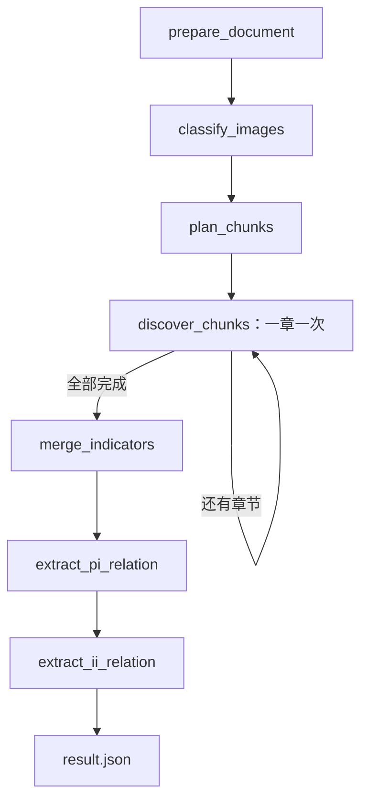

# 科学计量指标多模态抽取

从论文 Markdown 发现具名科学计量指标，完成文内归并，抽取论文—指标（PI）及指标—指标（II）关系。使用 DeepSeek、LangGraph、SQLite checkpoint，可选 LangSmith 追踪。

当前不执行 PDF/MinerU 解析、跨论文归并或 Neo4j 入库，也没有独立的公式、局限性抽取模块。结果标记为 `extracted_unverified`：来源定位通过不代表语义判断已验证。

## 项目结构

```text
project/
├── AGENTS.md                   # 提示词格式及开发约定
├── pyproject.toml / uv.lock     # Python 依赖与锁文件
├── Makefile                    # 常用命令
├── run.toml                    # 运行参数
├── .env.example                # 密钥、服务地址及追踪配置示例
├── data/                       # 已解析的 Markdown
├── src/scimetrics/
│   ├── __init__.py
│   ├── cli.py                  # 配置、运行、恢复、历史重放
│   ├── pipeline.py             # State、节点及图编排
│   ├── models.py               # 模型输出 schema
│   ├── prompts.py              # 总纲＋逐字段规则
│   └── utils/
│       ├── __init__.py
│       ├── document.py         # 图片、章节、多模态消息、文件工具
│       ├── evidence.py         # 来源定位与失败诊断
│       ├── merge.py            # 归并结构及引用校验
│       ├── client.py           # DeepSeek JSON 调用
│       └── observability.py    # LangSmith 追踪
├── outputs/                    # run.toml 指定的输出目录
└── .debug/
    ├── checkpoints.sqlite      # 检查点历史与任务配置
    └── .reports/               # 状态查看报告
```

## 安装与输入

要求 Python 3.13+ 和 uv。

```bash
make install
cp .env.example .env
# 在 .env 填写 DEEPSEEK_API_KEY，在 run.toml 设置 input
make start
```

输入必须是已有 `.md` 文件；`make run` 也支持目录批处理。图片必须使用模型服务能访问的 HTTP(S) URL，例如：

```markdown

```

不下载图片、不读取本地图片、不发送 Base64。支持普通 Markdown 图片、引用式图片和 HTML img；代码中的图片语法不作为真实图片。

## 流程



| 节点 | 输入与处理 | 写入 State |
| --- | --- | --- |
| prepare_document | 读取 Markdown，识别图片及原文位置 | raw_content、images |
| classify_images | 每次只发送一张图片，判断 scientific/decorative | images 的 classification |
| plan_chunks | 按一级、二级标题划分；过滤参考文献、基金、致谢、作者贡献、利益冲突等章节及空正文 | chunks、skipped_sections，初始化 chunk_discoveries |
| discover_chunks | 每次处理一个保留章节及科学图片，只发现本章有明确名称、缩写或已定义符号的指标 | 追加一个章节的 chunk_discoveries |
| merge_indicators | 候选归并；有歧义时补充候选来源章节及图片复核一次 | discovery、merge_map |
| extract_pi_relation | 所有保留章节＋其中科学图片＋统一指标清单 | paper_relations |
| extract_ii_relation | 同样的保留章节与清单，抽取指标间关系并写最终文件 | indicator_relations、extraction |

原文不改写。构造模型消息时，科学图片替换为真正的 `image_url` 内容块，按原文位置保持“前文 text → image_url → 后文 text”；装饰图片语法跳过。不插入 B/F 证据编号或额外图片 URL 说明块。

`chunks` 的 ID 沿用原章节编号，因此跳过章节后编号不连续。章节超过限额时报错，不自动拆分或截断。图片分类仍在一个节点内循环，不具备逐图恢复。

### 发现与归并

discover 输出 `indicator_id、name、aliases、definition、evidence`。程序将临时 ID 改为 `C0007_I001` 等文内候选 ID。无定义时 `definition=null`，无指标时 `indicators=[]`；泛称和普通变量不应成为指标。

归并首轮只使用全部候选记录，输出 `confirmed` 或 `needs_context` 分组。每个候选必须恰好属于一组，`evidence_refs` 用候选 ID 和证据下标引用依据。规范名与别名必须来自组内候选。

每个 `needs_context` 集合单独补充其来源章节及科学图片复核一次，不检索其他章节。复核后全部为 `confirmed`；缺少合并依据的候选分别成组，原因写入 `reason`。这里 confirmed 表示最终分组确定，不等于证明各组绝不相同。程序验证补充证据，并汇总原始字段，不让模型重写已有证据。

归并后的 `discovery.indicators` 每项为：

```text
indicator_id, name, aliases, definitions, evidence,
source_chunk_ids, candidate_ids
```

`definitions` 是列表。`merge_map` 保存 `canonical_name`、分组成员、依据引用、补充证据及复核记录；`name` 属于最终指标，`canonical_name` 属于归并映射。关系节点只收到 `discovery`，不接收整个 State 或 merge_map。

### PI：每个指标一条判定

输出字段：

```text
indicator_id, predicate, assertion_mode, evidence, rationale_summary,
no_relation_reason, no_relation_detail
```

必须覆盖全部指标，无遗漏、重复或新增 ID。有依据时按 `PROPOSES > MODIFIES > APPLIES` 选一个主关系：提出后又应用，仅输出 PROPOSES。无关系时 `predicate=null`、`assertion_mode=null`，记录“仅背景提及／未实际应用／证据不足”及具体原因。有关系时两个无关系原因字段为 null。

有关系至少一条证据；仅背景提及和未实际应用也需相关证据，证据不足允许 `evidence=[]`。无关系记录是审计记录，不应作为图谱边入库。PROPOSES 是基于本文证据的判断，不代表已外部核实全球首创。

### II：有据的指标间关系

输出字段：

```text
subject_id, predicate, object_id, assertion_mode, evidence, rationale_summary
```

端点必须是归并后的统一 ID，无自关系。同一指标对可有不同标签，但每种关系要有独立依据；同一三元组仅一条，多处证据汇总。不枚举所有指标对，不输出 null 或无关系记录；无关系或指标少于两个时返回空列表。

| predicate | 方向与含义 |
| --- | --- |
| VARIANT_OF | A → B：A 是 B 的明确变体 |
| DERIVED_FROM | A → B：A 直接来源于 B，改动超出简单变体 |
| IMPROVES_ON | A → B：A 针对 B 的缺陷改进 |
| ALTERNATIVE_TO | 对称：特定条件下可替代或竞争；每对只保存一次 |
| COMPONENT_OF | A → B：A 是 B 的输入指标、子指标或组成部分 |

同一方向不能同时为 VARIANT_OF 和 DERIVED_FROM；可与有独立依据的 IMPROVES_ON 等并存。ALTERNATIVE_TO 按指标清单顺序统一端点，反向重复也报错。没有 PI 的主关系优先级。代码校验结构及来源，不自动证明模型的关系语义判断。

PI 和 II 均区分 `explicit` 与 `inferred`。推断必须提供非空 `rationale_summary`，提示词要求说明“这是推断”，并按本条 evidence 下标指出依据。必要前提、适用条件和改进目标写入摘要，不单设 assumptions、scope 或 origin_status。II 不读取 PI 判定，不能因为本文同时使用两个指标就假定它们有关系。

## 证据校验与输出

模型生成的证据为 `kind、quote、observation`。文字 quote 须逐字引用，保留大小写、OCR 拼写及 LaTeX；视觉 quote 为实际图片 URL，observation 描述区域及所见。

程序先精确匹配（exact），再有限排版规范化匹配（normalized）：统一连续空白、排版引号、部分 Unicode 连字符和连字，以及连接符/括号等边界空白。保留普通词间空格、大小写、数值和小数点，不做任意模糊放行或公式等价推断。失败仅保存诊断并报错，不额外调用模型修复。

文字证据成功后，`quote` 保存真实原文，附加 `extracted_quote、match_method、source_file、source_spans`；唯一匹配时额外写 `source_start/source_end`。位置为原 Markdown 的 Python 字符偏移，左闭右开。多处匹配保留全部位置及对应原句。元数据由程序添加，不要求模型生成；视觉证据无文字位置字段。

PI/II 的单条文字证据必须位于某个保留章节内，不能引用 skipped_sections 或跨章节拼接。近似定位可能显示其他位置，但仅供诊断。旧章节结果不会自动补写新字段。

最终 JSON 包含：

```text
status, indicators, merge_map, paper_relations, indicator_relations,
chunks, skipped_sections
```

| 模式或产物 | 位置 |
| --- | --- |
| make run | `<output>/<文件名>-<路径哈希前8位>/result.json` |
| 检查点任务 | 首次 start 保存的 `<output>/result.json` |
| 证据失败诊断和本次抽取结果 | 对应输出目录的 `evidence_errors/<stage>.json` |
| 检查点报告 | `<db所在目录>/.reports/<thread_id>.json` |

报告会覆盖；执行 make inspect 才会导出所选 State 字段与任务错误。SQLite 保存历史检查点，报告 JSON 不是恢复依据。历史错误报告不表示本轮仍失败；重跑可能覆盖同名结果文件。

## 配置

参数统一放在 run.toml 的 `[run]`，密钥放在 `.env`。示例：

```toml
[run]
input = "data/paper.md"
output = "outputs"
action = "run"
pattern = "*.md"
model = "deepseek-flash"
max_output_tokens = 65536
max_chars = 250000
max_images = 40
max_body_bytes = 40000000
timeout = 600

db = ".debug/checkpoints.sqlite"
thread_id = "paper-001"
replay_node = "extract_pi_relation"
stop_after = ["prepare_document", "classify_images", "plan_chunks", "merge_indicators", "extract_pi_relation"]
stop_before = ["merge_indicators"]
field = "all"
```

`input/output/db` 的相对路径相对于配置文件目录；`.env` 也从该目录加载，已有环境变量优先。CLI 的 `--config` 相对于当前工作目录。代码中 output 未配置时默认为 `.debug`，项目 run.toml 显式配置为 outputs。

`max_output_tokens` 控制单次输出上限，timeout 单位秒；其余为文本字符、科学图片数量及消息体字节预算，不能等同于模型 token 上下文上限。关系节点对所有保留章节和清单的总输入检查限额。HTTP SDK 最多重试两次；JSON 解析、语义和来源校验失败不自动重试。非 stop 响应打印 finish_reason、token 用量和响应 ID。

`field` 可选 all、raw_content、images、chunks、skipped_sections、chunk_discoveries、discovery、merge_map、paper_relations、indicator_relations、extraction。

## 命令与检查点

| 命令 | 行为 |
| --- | --- |
| make help | 显示使用提示 |
| make install | uv sync 安装依赖 |
| make run | 从头完整执行，无持久化 checkpoint，忽略暂停点；支持目录批处理 |
| make start | 为新 thread_id 启动单篇任务，保存检查点，遵循暂停点 |
| make inspect | 查看最新状态，不调用模型 |
| make resume | 从最新检查点继续，遵循 stop_before/stop_after |
| make continue | 从最新检查点继续，临时忽略全部暂停点，仍保存检查点 |
| make replay | 从历史检查点重跑 replay_node 及后续流程，遵循暂停点 |

替换配置文件：

```bash
make resume CONFIG=another.toml
uv run scimetrics --config run.toml --action inspect
```

CLI 仅接受 `--config`、`--action` 和帮助选项。Make 的动作覆盖 TOML 的 action。

### 按阶段运行

```bash
make start       # 新任务：prepare 完成后暂停
make resume      # classify 完成后暂停
make resume      # plan 完成后暂停
make resume      # 所有 chunk 完成，merge 开始前暂停
make inspect
make resume      # merge 完成后暂停
make resume      # PI 完成后暂停
make inspect
make resume      # II 完成，保存最终结果
```

以上对应示例暂停配置。discover_chunks 每次执行一章并在下一步前同步保存；失败后 resume 只重做失败章节。若将 discover_chunks 加回 stop_after，则每成功一章暂停。前后暂停列表都为空时 resume 与 continue 效果相同。

分类和整个 merge 各自仍是一个执行步，节点内部中途失败会重做整个节点。图步数上限为 10000。不要并发运行相同 thread_id。

### 重跑 PI 或 II

将 replay_node 设置为目标节点，例如：

```toml
replay_node = "extract_ii_relation"
```

```bash
make replay
make inspect
```

replay 从同一 thread_id 的历史中，选择最近一个 next 包含目标节点的检查点，从那里执行。不会从头重跑，也不会删除旧历史；找不到历史起点则报错。新执行产生分支，之后 resume 从最新检查点继续。对 discover_chunks 的 replay 只从最近一次待处理章节处开始，不表示重做全部章节。

replay 仍遵循暂停点；当前 PI 后有暂停，II 完成则写结果。每次 replay 都重新选择历史起点，resume 不使用 replay_node。服务调用会重新产生费用，最终文件可能覆盖，旧检查点不会撤销文件等外部副作用。

### 配置变更

start 固定保存输入、输出、模型及输入文件哈希。resume/replay 使用保存的输入、输出和模型，但使用当前 TOML 的五项资源限额、暂停配置等。更改原始 Markdown 会拒绝恢复；需新 thread_id。修改代码/提示词只影响后续或重跑的节点，不自动更新已完成结果。不提供旧 State/schema 迁移。

## LangSmith 与开发约定

`.env.example` 列出 DEEPSEEK_API_KEY、DEEPSEEK_BASE_URL、LANGSMITH_TRACING、LANGSMITH_API_KEY、LANGSMITH_PROJECT、LANGSMITH_ENDPOINT。开启 LangSmith 后，模型输入、输出和图片 URL 等会上传追踪服务；LangSmith 用于诊断，SQLite 用于恢复，两者不能互相替代。

提示词按“总纲＋字段填写规则”组织。项目不新增测试文件或测试代码，修改使用语法、导入、配置、图构建及必要的实际数据检查验证；未调用模型的检查不代表已验证抽取准确率。
